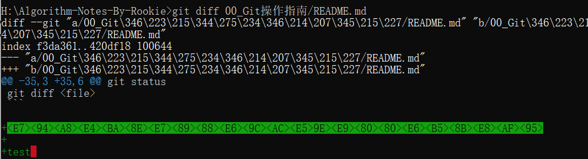
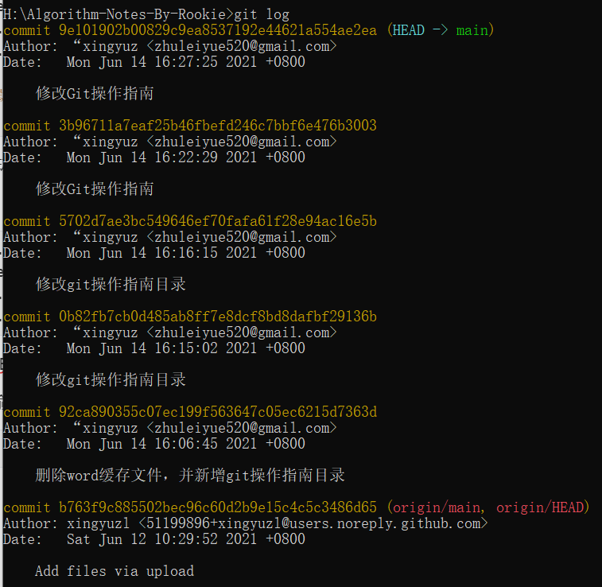
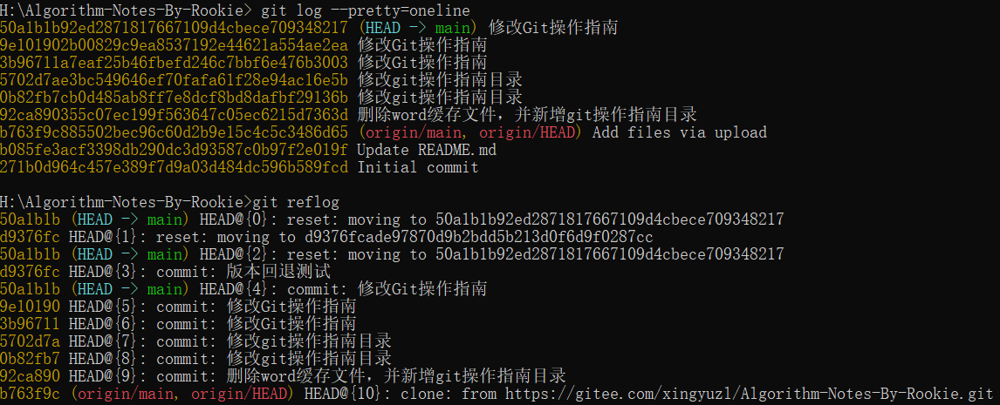

# GIT操作指南

## 初始化目录

```shell
git init
```

## 新增文件

```shell
git add <file>
git add --all

git add file1.txt
```

## 提交文件

```shell
git commit -m <message>

git commit -m "add 3 files."
```

## 查看当前工作区状态

```shell
git status
```

## 查看做了文件哪些修改

```shell
git diff <file>
```



测试的时候中文显示[乱码](https://www.jianshu.com/p/fc8162ed1e3d?utm_campaign=maleskine&utm_content=note&utm_medium=seo_notes&utm_source=recommendation)。此时解决办法为：

-   Linux

```shell
$ git config --global core.quotepath false          # 显示 status 编码
$ git config --global gui.encoding utf-8            # 图形界面编码
$ git config --global i18n.commit.encoding utf-8    # 提交信息编码
$ git config --global i18n.logoutputencoding utf-8  # 输出 log 编码
$ export LESSCHARSET=utf-8
# 最后一条命令是因为 git log 默认使用 less 分页，所以需要 bash 对 less 命令进行 utf-8 编码
```

想长期生效的 话要改profile添加环境变量

-   windows

```shell
$ git config --global core.quotepath false          # 显示 status 编码
$ git config --global gui.encoding utf-8            # 图形界面编码
$ git config --global i18n.commit.encoding utf-8    # 提交信息编码
$ git config --global i18n.logoutputencoding utf-8  # 输出 log 编码
```

我使用cmd，直接添加环境变量LESSCHARSET，变量值utf-8，重启电脑让变量生效。

不重启电脑快速测试的话，cmd输入命令

```shell
set LESSCHARSET=utf-8
```

## 查看版本快照（commit）信息

```shell
git log
git log --pretty=oneline
```



## 版本回退

```shell
git reset --hard 50a1b
```


Git回退速度快，因为回退就是HEAD指针的移动。

此时Git版本库就没有d93的版本了。如果第二天后悔了

```shell
git reflog
```


