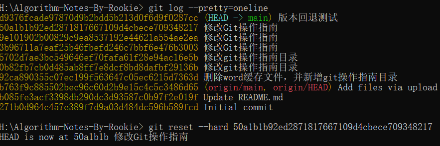

# GIT操作指南

## 初始化目录

```shell
git init
```

## 新增文件

```shell
git add <file>
git add --all

git add file1.txt
```

## 提交文件

```shell
git commit -m <message>

git commit -m "add 3 files."
```

## 查看当前工作区状态

```shell
git status
```

## 查看做了文件哪些修改

```shell
git diff <file>
```


测试的时候中文显示[乱码](https://www.jianshu.com/p/fc8162ed1e3d?utm_campaign=maleskine&utm_content=note&utm_medium=seo_notes&utm_source=recommendation)。此时解决办法为：

-   Linux

```shell
$ git config --global core.quotepath false          # 显示 status 编码
$ git config --global gui.encoding utf-8            # 图形界面编码
$ git config --global i18n.commit.encoding utf-8    # 提交信息编码
$ git config --global i18n.logoutputencoding utf-8  # 输出 log 编码
$ export LESSCHARSET=utf-8
# 最后一条命令是因为 git log 默认使用 less 分页，所以需要 bash 对 less 命令进行 utf-8 编码
```

想长期生效的 话要改profile添加环境变量

-   windows

```shell
$ git config --global core.quotepath false          # 显示 status 编码
$ git config --global gui.encoding utf-8            # 图形界面编码
$ git config --global i18n.commit.encoding utf-8    # 提交信息编码
$ git config --global i18n.logoutputencoding utf-8  # 输出 log 编码
```

我使用cmd，直接添加环境变量LESSCHARSET，变量值utf-8，重启电脑让变量生效。

不重启电脑快速测试的话，cmd输入命令

```shell
set LESSCHARSET=utf-8
```

## 查看版本快照（commit）信息

```shell
git log
git log --pretty=oneline
```


## 版本回退

```shell
git reset --hard 50a1b
```



Git回退速度快，因为回退就是HEAD指针的移动。

此时Git版本库就没有d93的版本了。如果第二天后悔了

```shell
git reflog
```


## 工作区、暂存区、版本区

你能看见的当前工作目录是工作区

git add之后是暂存区


git commit以后就到了.git目录，是版本区


## 撤销修改

-   修改工作区，未添加到暂存区（没有add）

```shell
git checkout -- file # 其实是用版本库替换工作区
```

-   修改内容到暂存区（没有commit）

```shell
git reset HEAD <file>
```

-   提交到版本库，没有发布到远程库

```
参考版本回退
```

-   发布到远程库

```
gameover，因为git是分布式的
```

## 删除文件

```shell
git rm <file> #作用等同git add 
git commit -m '' #到版本库
```

## 远程仓库

```shell
# 【1】创建SSH Key。一路enter下去
ssh-keygen -t rsa -C "youremail@example.com"
# 【2】去github或者码云网页授权本电脑
```

### 关联远程仓库

-   本地新建目录（远程仓库新建项目未初始化）

```shell
git remote add origin git@gitee.com:xingyuzl/Algorithm-Notes-By-Rookie.git #origin是远程仓库名称，Git默认叫法
#由于远程库是空的，我们第一次推送master分支时，加上了-u参数，Git不但会把本地的master分支内容推送的远程新的master分支，还会把本地的master分支和远程的master分支关联起来，在以后的推送或者拉取时就可以简化命令。
git push -u origin master # 此时本地和远程一模一样了
```

-   远程有库且已经初始化

```shell
git clone ....
```

### 查看远程库信息

```shell
git remote -v
```

### 删除远程库

```shell
git remote rm <name>

$ git remote rm origin
```

## 分支管理

如开发一个新功能，可以起一个新分支，自己开发完了以后再合并到原来分支。

### 创建分支

```shell
# 创建dev分支，然后切换到dev分支：-b参数表示创建并切换
git checkout -b dev
# 或者
git switch -c dev

#上述命令相当于两条命令
git branch dev
git checkout dev
```

此时提交修改都会在新的分支上操作了


### 切换分支

```shell
# 撤销修改是git checkout -- <file>
git checkout dev

# 或者
git switch master
```


### 查看当前分支

```shell
git branch
```

### 合并分支

```shell
 # 合并指定分支到当前分支
 git merge dev
```


Fast-forward表示合并是“快进模式”，也就是直接把`master`指向`dev`的当前提交，所以合并速度非常快。

还有其它模式的合并。

比如在两个分支同时修改同一个文件


合并以后文件出现

```shell
Git is a distributed version control system.
Git is free software distributed under the GPL.
Git has a mutable index called stage.
Git tracks changes of files.
<<<<<<< HEAD
Creating a new branch is quick & simple.
=======
Creating a new branch is quick AND simple.
>>>>>>> feature1
```

此时手动修改再提交即可。

### 删除分支

```shell
git branch -d dev
```

### Bug分支

你正在dev分支上开发新功能，要两天。突然有一个bug要修复，但是你新功能开发了一半了，怎么办？

```
【1】 git stash，把工作现场储存起来。
	此时git status查看时干净的了
【2】切换到master分支（需要修改bug的分支），并从master分支创建新分支
	git checkout master
	git checkout -b issue-101
【3】修改bug并add和commit
	$ git add readme.txt 
    $ git commit -m "fix bug 101"
    [issue-101 4c805e2] fix bug 101
 		1 file changed, 1 insertion(+), 1 deletion(-)
【4】切回master分支，合并，并删除issue-101分支
【5】切回dev分支继续开发新功能
【6】git stash list查看储存的工作现场
	$ git stash list
	stash@{0}: WIP on dev: f52c633 add merge
【7】恢复工作现场
	git stash apply stash@{0} 
	git stash drop stash@{0} 
    或者
    git stash pop，恢复的同时也删掉了
【8】在dev分支上修复bug，重放之前修复bug的提交
	git cherry-pick 4c805e2
```

### Feature分支

你要开发一个新功能，一般不可以把主分支搞乱。

此时可以创建一个新分支

```shell
# 【1】新建分支
git switch -c feature-vulcan
# 【2】切回dev分支并准备合并
git switch dev
# 【3】上级说新功能不要了，且要就地销毁 （-d表示强制删除）
git branch -d feature-vulcan
```

### 多人协作

远程克隆时，Git自动把本地的`master`分支和远程的`master`分支对应起来了，并且，远程仓库的默认名称是`origin`。

```shell
git remote #查看远程库信息
git remote -v #显示更详细的信息
```

```shell
# 推送master到远程origin
git push origin master
# 推送dev到远程origin
git push origin dev
```

```shell
git clone 后，默认只能看到master分支
要创建远程origin的dev分支到本地
git checkout -b dev origin/dev
此后就可以在dev上操作了，但是推送到远程的时候会出错，需要关联本地dev和远程dev
git branch --set-upstream-to=origin/dev dev
```

### rebase

-   rebase操作可以把本地未push的分叉提交历史整理成直线；
-   rebase的目的是使得我们在查看历史提交的变化时更容易，因为分叉的提交需要三方对比。

```shell
$ git log --graph --pretty=oneline --abbrev-commit
*   e0ea545 (HEAD -> master) Merge branch 'master' of github.com:michaelliao/learngit
|\  
| * f005ed4 (origin/master) set exit=1
* | 582d922 add author
* | 8875536 add comment
|/  
* d1be385 init hello
...
```

rebase后

```shell
$ git log --graph --pretty=oneline --abbrev-commit
* 7e61ed4 (HEAD -> master) add author
* 3611cfe add comment
* f005ed4 (origin/master) set exit=1
* d1be385 init hello
...
```

## 标签管理

没有标签，发布版本时需要：“请把上周一的那个版本打包发布，commit号是6a5819e...”

有了标签，“请把上周一的那个版本打包发布，版本号是v1.2”

所以tag就是一个让人容易记住的有意义的名字，它跟某个commit绑在一起。

### 创建标签

```shell
git tag <name>
# 将最新commit打包成v1.0
$ git tag v1.0
# 同时需要将上周五的commit打包成v0.9时
#首先查看历史提交的commit id
git log --pretty=oneline --abbrev-commit
git tag v0.9 f52c633
#可以指定附加信息
git tag -a <tagname> -m "version 0.1 released" 1094adb
```

如果commit既出现在master分支，又出现在dev分支，那么在这两个分支上都可以看到这个标签。

### 查看标签

```shell
git tag
# 查看标签信息
git show <tagname>
$ git show v0.9
```

### 删除标签

```shell
git tag -d v0.1
# 删除远程标签
# 首先删除本地标签
git tag -d v0.9
# 再从远程删除
git push origin :refs/tags/v0.9
```

### 推送标签到远程

```shell
git push origin v1.0
# 一次推送所有标签到远程
git push origin --tags
```

## 参与github代码维护

比如你要贡献bootstrap。

```shell
【1】将代码fork到自己账号下
【2】自己账号下的bootstrap clone到本地
【3】修改本地代码并提交至自己账号的bootstrap
【4】向bootstrap官方提交pull request，等待人家的同意
```

```ascii
┌─ GitHub ────────────────────────────────────┐
│                                             │
│ ┌─────────────────┐     ┌─────────────────┐ │
│ │ twbs/bootstrap  │────>│  my/bootstrap   │ │
│ └─────────────────┘     └─────────────────┘ │
│                                  ▲          │
└──────────────────────────────────┼──────────┘
                                   ▼
                          ┌─────────────────┐
                          │ local/bootstrap │
                          └─────────────────┘
```

## 代码关联github和gitee

```shell
# 查看远程库信息
git remote -v
	origin	git@gitee.com:liaoxuefeng/learngit.git (fetch)
	origin	git@gitee.com:liaoxuefeng/learngit.git (push)
# 删除本地所有已经关联的远程库
git remote rm origin
# 关联GitHub
git remote add github git@github.com:xingyuzl/Algorithm-Notes-By-Rookie.git
# 关联Gitee
git remote add gitee git@gitee.com:xingyuzl/Algorithm-Notes-By-Rookie.git
# 推送
git push github master
git push gitee master
┌─────────┐ ┌─────────┐
│ GitHub  │ │  Gitee  │
└─────────┘ └─────────┘
     ▲           ▲
     └─────┬─────┘
           │
    ┌─────────────┐
    │ Local Repo  │
    └─────────────┘
```

## 编写.gitignore

.gitignore要提交并推送到远程

```
## 强制提交忽略的文件，加-f，如git add -f App.class
## git check-ignore -v App.class 查看哪些规则应用到了App.class

# Windows:
Thumbs.db
ehthumbs.db
Desktop.ini

# Python:
*.py[cod]
*.so
*.egg
*.egg-info
dist
build

# My configurations:
db.ini
deploy_key_rsa

# 排除所有.开头的隐藏文件:
.*
# 排除所有.class文件:
*.class

# 不排除.gitignore和App.class:
!.gitignore
```

## 配置别名

```shell
如何用git st表示git status

git config --global alias.st status

git config --global alias.lg "log --color --graph --pretty=format:'%Cred%h%Creset -%C(yellow)%d%Creset %s %Cgreen(%cr) %C(bold blue)<%an>%Creset' --abbrev-commit"
```

```shell
# 配置Git的时候，加上--global是针对当前用户起作用的，如果不加，那只针对当前的仓库起作用。
# 仓库的Git配置文件都放在.git/config文件中

$ cat .git/config 
[core]
    repositoryformatversion = 0
    filemode = true
    bare = false
    logallrefupdates = true
    ignorecase = true
    precomposeunicode = true
[remote "origin"]
    url = git@github.com:michaelliao/learngit.git
    fetch = +refs/heads/*:refs/remotes/origin/*
[branch "master"]
    remote = origin
    merge = refs/heads/master
#别名就在[alias]后面，要删除别名，直接把对应的行删掉即可。
[alias]
    last = log -1
```

```shell
# 用户主目录下的.gitconfig
[alias]
    co = checkout
    ci = commit
    br = branch
    st = status
[user]
    name = Your Name
    email = your@email.com
```

## 搭建Git私服

在[远程仓库](https://www.liaoxuefeng.com/wiki/896043488029600/896954117292416)一节中，我们讲了远程仓库实际上和本地仓库没啥不同，纯粹为了7x24小时开机并交换大家的修改。

GitHub就是一个免费托管开源代码的远程仓库。但是对于某些视源代码如生命的商业公司来说，既不想公开源代码，又舍不得给GitHub交保护费，那就只能自己搭建一台Git服务器作为私有仓库使用。

搭建Git服务器需要准备一台运行Linux的机器，强烈推荐用Ubuntu或Debian，这样，通过几条简单的`apt`命令就可以完成安装。

假设你已经有`sudo`权限的用户账号，下面，正式开始安装。

第一步，安装`git`：

```
$ sudo apt-get install git
```

第二步，创建一个`git`用户，用来运行`git`服务：

```
$ sudo adduser git
```

第三步，创建证书登录：

收集所有需要登录的用户的公钥，就是他们自己的`id_rsa.pub`文件，把所有公钥导入到`/home/git/.ssh/authorized_keys`文件里，一行一个。

第四步，初始化Git仓库：

先选定一个目录作为Git仓库，假定是`/srv/sample.git`，在`/srv`目录下输入命令：

```
$ sudo git init --bare sample.git
```

Git就会创建一个裸仓库，裸仓库没有工作区，因为服务器上的Git仓库纯粹是为了共享，所以不让用户直接登录到服务器上去改工作区，并且服务器上的Git仓库通常都以`.git`结尾。然后，把owner改为`git`：

```
$ sudo chown -R git:git sample.git
```

第五步，禁用shell登录：

出于安全考虑，第二步创建的git用户不允许登录shell，这可以通过编辑`/etc/passwd`文件完成。找到类似下面的一行：

```
git:x:1001:1001:,,,:/home/git:/bin/bash
```

改为：

```
git:x:1001:1001:,,,:/home/git:/usr/bin/git-shell
```

这样，`git`用户可以正常通过ssh使用git，但无法登录shell，因为我们为`git`用户指定的`git-shell`每次一登录就自动退出。

第六步，克隆远程仓库：

现在，可以通过`git clone`命令克隆远程仓库了，在各自的电脑上运行：

```
$ git clone git@server:/srv/sample.git
Cloning into 'sample'...
warning: You appear to have cloned an empty repository.
```

剩下的推送就简单了。

### 管理公钥

如果团队很小，把每个人的公钥收集起来放到服务器的`/home/git/.ssh/authorized_keys`文件里就是可行的。如果团队有几百号人，就没法这么玩了，这时，可以用[Gitosis](https://github.com/res0nat0r/gitosis)来管理公钥。

这里我们不介绍怎么玩[Gitosis](https://github.com/res0nat0r/gitosis)了，几百号人的团队基本都在500强了，相信找个高水平的Linux管理员问题不大。

### 管理权限

有很多不但视源代码如生命，而且视员工为窃贼的公司，会在版本控制系统里设置一套完善的权限控制，每个人是否有读写权限会精确到每个分支甚至每个目录下。因为Git是为Linux源代码托管而开发的，所以Git也继承了开源社区的精神，不支持权限控制。不过，因为Git支持钩子（hook），所以，可以在服务器端编写一系列脚本来控制提交等操作，达到权限控制的目的。[Gitolite](https://github.com/sitaramc/gitolite)就是这个工具。

这里我们也不介绍[Gitolite](https://github.com/sitaramc/gitolite)了，不要把有限的生命浪费到权限斗争中。

### 小结

-   搭建Git服务器非常简单，通常10分钟即可完成；
-   要方便管理公钥，用[Gitosis](https://github.com/res0nat0r/gitosis)；
-   要像SVN那样变态地控制权限，用[Gitolite](https://github.com/sitaramc/gitolite)。

