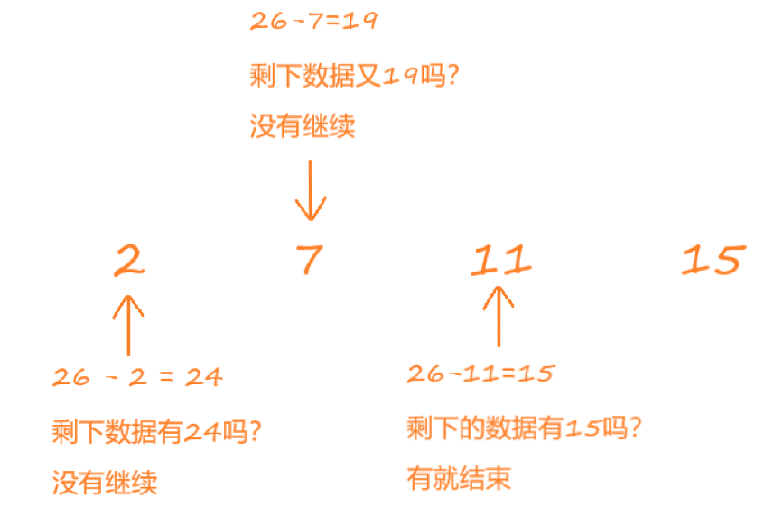

# 菜鸟的算法笔记：两数之和

## 问题

给定一个整数数组 `nums` 和一个整数目标值 `target`，请你在该数组中找出 **和为目标值** *`target`* 的那 **两个** 整数，并返回它们的数组下标。

你可以假设每种输入只会对应一个答案。但是，数组中同一个元素在答案里不能重复出现。

你可以按任意顺序返回答案。


## 解决方法

### 遍历穷举法算法

直观的说，就是看第一个元素和第二个元素的和是否为26？如果不是，再看第一个元素和第三个元素的和是否为26？一直到看第三个元素加第四个元素是否等于26。

文字太复杂，看图。


翻译成代码如下。

```python
from typing import List
class Solution:
    def twoSum(self, nums: List[int], target: int) -> List[int]:
        n = len(nums)
        for i in range(n):
            first_num = nums[i]
            next_num = target - first_num
            for j in range(i + 1, n):
                if next_num == nums[j]:
                    return [i, j]
        return None
```

#### 复杂度分析

复杂度分析采用大O表示法。

##### 时间复杂度

以上程序耗费时间最大的地方在于第5行和第8行两个循环。

第5行共执行 $n$ 次，第8行执行次数和变量 $i$ 有关， $i = 0$ 时执行 $n-1$ 次 ， $i = 1$ 时执行 $n-2$ 次 , $i = n-1$ 时执行 $0$ 次，所以平均执行了$\frac{n-1}{2}$ 次。利用乘法原则，算法总共执行了$\frac{n*(n-1)}{2}$次。去掉系数，算法的时间复杂度是$O(n^2)$。

##### 空间复杂度

显而易见，程序耗费的内存不回随着 $nums$ 数组里元素(也就是 $n$ )的增长而增长，它是常量。因此空间复杂度为$ O(1) $。

#### 执行


### 遍历+哈希表算法

首先我们计算26与第一个元素（2）的差（24），并看剩下的数据（[7, 11, 15]）里是不是有这个差？如果没有则继续计算26与第二个元素（7）的差（19），如果剩余数据里（[11, 15]）有这个差，则遍历结束,没有则继续$\cdots$。

文字太复杂，看图。



翻译成代码如下。

```python
from typing import List
class Solution:
    def twoSum(self, nums: List[int], target: int) -> List[int]:
        n = len(nums)
        # 将nums转为字典，key列表里的值，value为值对应的下标。如[2, 7, 11, 15]转成{2: 0, 7: 1, 11: 3, 15: 4}
        nums_dict = dict(zip(nums, range(n)))
        for i in range(n):
            # 剩余数据里获取（target - nums[i]） 的索引，如果不存在返回-1
            next_index = nums_dict.get(target - nums[i], -1)
            if next_index != -1 and next_index != i:
                return [i, next_index]
        return None
```

#### 复杂度分析

##### 时间复杂度

第6行程序时间复杂度为$O(n)$，第7行程序时间复杂度为$O(n)$，所以总的算法时间复杂度是$O(n)$。

注：字典里取数据的时间复杂度为：$O(1)$

##### 空间复杂度

程序在第6行需要额外申请$O(n)$的空间来存储字典。

注：字典存 $n$ 个数据的空间复杂度为 $O(n)$。

#### 执行


可以从两次执行效率上看出，遍历+哈希算法的计算速度比遍历穷举算法计算速度有显著提升。但是耗费的内存增加了，这也是用空间换时间的应用。

