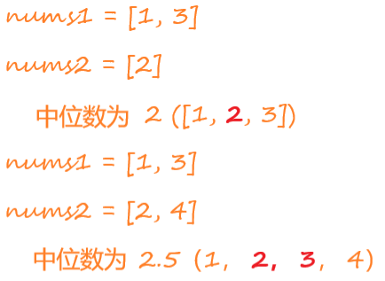
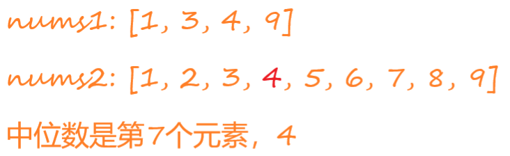

# 菜鸟的算法笔记：寻找两个正序数组的中位数


## 问题

给定两个大小分别为 `m` 和 `n` 的正序（从小到大）数组 `nums1` 和 `nums2`。请你找出并返回这两个正序数组的 **中位数** 。



停下来思考下，你能想到什么解法？

## 解决方法

```
中位数被用来将一个集合划分为两个长度相等的子集，其中一个子集中的元素总是大于另一个子集中的元素。
对一个长度为length的集合。
    如果length为偶数，中位数就是集合的第length/2 - 1 和 length/2个元素 
	如果length为奇数，中位数就是集合的length//2个元素
		length//2表示除2以后向下取整，比如3/2 = 1.5，向下取整就是1，所以3//2=1	
```

### 暴力排序法

就是将两个数组合并，然后根据合并后数组的长度是奇数还是偶数，再返回中位数就可以了。

翻译成代码如下。

```python
class Solution:
    def findMedianSortedArrays(self, nums1: List[int], nums2: List[int]) -> float:
		num = nums1 + nums2
        num = sorted(num)
        length = len(num)
        return num[length//2] if length % 2 == 1 else (num[length // 2] + num[length // 2 - 1]) / 2
```

#### 复杂度分析

##### 时间复杂度

上述程序最耗时的是第4行。

排序算法根据时间复杂度主要分为三类：

-   $O(n^2)$：比如冒泡排序、插入排序、选择排序等
-   $O(n \log n)$：比如快速排序、归并排序、堆排序等
-   $O(n)$比：如桶排序、计数排序、基数排序等

最快的排序算法( $O(n)$算法 ）只适合某些特殊场景，并不普遍适用。而工业级排序算法根据需要排序的数据特征，一般采用插入排序、快速排序和堆排序。

一般可以认为常用语言中的排序算法时间复杂度为$O(n \log n)$。其中 $n$ 为需要排序的数组长度。

所以本程序时间复杂度为$O(n \log n)$，其中 $n$ 是 $num$ 数组的长度，即 $nums1$ 的长度和 $nums2$ 的长度之和。

##### 空间复杂度

程序中最费内存的是第3行代码，它需要开辟新空间来存储 $num$ 。

所以本程序空间复杂度为$O(n)$，其中 $n$ 是 $num$ 数组的长度，即 $nums1$ 的长度和 $nums2$ 的长度之和。

#### 执行


### 基于归并的遍历算法

名字是我胡乱编的。该算法借助了归并排序的合并数组思想。

其实很简单，每次取两个数组里的更小的元素弹出，一直弹出第 $length/2 - 1$ 和 $length/2$ 个元素（两个数组长度之和偶数）或第 $length//2$ 个元素（两个数组长度之和为奇数）。

图解如下：


中位数索引为2，因为索引从0开始，所以要弹出第3个元素。

翻译成代码如下。

```python
class Solution:
    def findMedianSortedArrays(self, nums1: List[int], nums2: List[int]) -> float:
		m, n = len(nums1), len(nums2)
        length = m + n
        # 需要弹出的索引
        k = set([length // 2]) if length % 2 == 1 else set([length // 2 - 1, length // 2])
        # 总共弹出的次数，从0开始
        pop_index = -1
        sum = 0
        while k:
            if not nums1: # 如果nums1数组为空，弹出nums2的第一个元素
                pop_value = nums2.pop(0)
            elif not nums2: # 如果nums2数组为空，弹出nums1的第一个元素
                pop_value = nums1.pop(0)
            elif nums1[0] < nums2[0]: # 弹出较小的元素
                pop_value = nums1.pop(0)
            else: # 弹出较小的元素
                pop_value = nums2.pop(0)
            pop_index += 1
            # 弹出的索引是中位数的索引
            if pop_index in k:
                sum += pop_value
                k.remove(pop_index)
        return sum if length % 2 == 1 else sum / 2
```

#### 复杂度分析

##### 时间复杂度

本程序最多只需要遍历 $length/2$ 次，去掉常数项，时间复杂度为 $O(m + n)$。

需要特别说明的是，上述程序只是为了说明方法的原理而简写的程序。因为 $nums1.pop(0)$ 操作的时间复杂度为 $O(m)$， $nums2.pop(0)$ 操作的时间复杂度为 $O(n)$，实际编程时。可以设置两个指针 $left$ 和 $right$， $nums1.pop(0)$ 时 $left = left + 1$， $nums2.pop(0)$ 时 $right = right + 1$。$nums1[0]$替换为 $nums1[left]$， $nums2[0]$替换为 $nums2[right]$ 即可。

##### 空间复杂度

本程序没有额外与 $m$ 或 $n$ 相关的申请空间，所以空间复杂度为 $O(1)$。

#### 执行


### 二分查找法

一般而言，看到有序数组就应该要想到二分查找。

在一个有序数组里，二分查找的时间复杂度为$O(\log n)$。几乎为最快的算法了。

比如求下列两个数组的中位数：



利用排除法。

上述两个数组中位数索引 $k=6$，先比较 $nums1[2] = 4$ 和 $nums2[2] = 3$。发现$ 4 > 3$，所以可以得出结论，$nums1$ 中比3小的元素最多2个。所以 $nums2[2] = 3$ 最多排在第5位。这样可以肯定的是 $nums2[0]$、 $nums2[1]$、 $nums2[2]$肯定不是中位数排除掉。


接下来重复使用删除法。


继续删除法


翻译成代码如下。

```python
class Solution:
    def findMedianSortedArrays(self, nums1: List[int], nums2: List[int]) -> float:
        m, n = len(nums1), len(nums2)
        length = m + n
        
        def getKthElement(k):
            nums1_offset, nums2_offset = 0, 0
            while True:
                # 特殊情况
                if nums1_offset == m:
                    return nums2[nums2_offset + k]
                if nums2_offset == n:
                    return nums1[nums1_offset + k]
                if k == 0:
                    return min(nums1[nums1_offset], nums2[nums2_offset])
                # 正常情况
                new_nums1_offset = min(nums1_offset + (k + 1) // 2 - 1, m - 1);
                new_nums2_offset = min(nums2_offset + (k + 1) // 2 - 1, n - 1);
                pivot1, pivot2 = nums1[new_nums1_offset], nums2[new_nums2_offset]
                if pivot1 < pivot2:
                    k -= new_nums1_offset - nums1_offset + 1
                    nums1_offset = new_nums1_offset + 1
                else:
                    k -= new_nums2_offset - nums2_offset + 1
                    nums2_offset = new_nums2_offset + 1
        if length % 2 == 1:
            return getKthElement(length // 2)
        else:
            return (getKthElement(length // 2) + getKthElement(length // 2 - 1)) / 2
```

注意，上述绘图解题中，$k$ 要一直跌倒到0。

#### 复杂度分析

##### 时间复杂度

每次迭代都会排除掉大约一半的数据（$(k + 1) // 2 - 1$）。因此其复杂度位$O(\log (m + n))$，其中 $m$ 是 $nums1$ 数组的长度，$n$ 是 $nums2$ 数组的长度。

##### 空间复杂度

上述程序可以看到，并没有申请与$m$ 或 $n$ 相关的新空间，因此空间复杂度位 $O(1)$。

#### 执行


### 划分数组法

假设 $nums1$ 的长度 $m$ 小于$nums2$ 的长度 $n$。

```
nums1 = [a{1}, a{2}, ..., a{i}, ..., a{m-1}]
nums2 = [b{1}, b{2}, ..., b{j}, ..., b{n-1}]
```

合并nums1和nums2

```
nums = [nums1[:i],nums2[:j] | nums1[i:], nums2[j:]]
```

假设 | 左边的元素个数为 $i + j = k = (m + n + 1 ) // 2$，且满足左边元素都小于右边元素。

此时可得出结论：

-   $ m + n$为奇数时，$\max(nums1[i-1], nums2[j-1])$为中位数

-   $ m + n$为偶数时，$\frac{(\max(nums1[i-1], nums2[j-1]) + \min(nums1[i], nums2[j])}{2}$为中位数

要确保左边的数都小于右边，必须有

-   $nums2[j-1] \lt nums1[i]$

但是，如果$nums2[j-1] \gt nums[i]$，则$i$要向右移动

比如下面这个例子。


$m = 4, n = 10, k = (4 + 10 + 1) // 2 = 7$

首先，$i$ 必定在$nums1[0: 4]$之间，所以取 $i = 0 + (4 - 0) // 2 = 2 $，$j = k - i = 5$。


$nums2[4] = 4 > nums1[i]=3$，$i$要向右移动，所以 $i$ 必定在nums1[2: 4]之间。取$i = 2 + (4 - 2) // 2 = 3$，$j = k - i = 4$。


$(nums2[3] = 4) = (nums1[2] = 4)$，所以$i$ 不向右移动，$i$ 必定在nums1[2: 2] 之间。

$m + n = 14$为偶数，所以中位数为$\frac{4 + 5}{2} = 4.5$

翻译成代码如下：

```python
class Solution:
    def findMedianSortedArrays(self, nums1: List[int], nums2: List[int]) -> float:
        m, n = len(nums1), len(nums2)
        # 确保nums1长度小于nums2长度
        if m > n:
            m, n = n, m
            nums1, nums2 = nums2, nums1
        # 中位数位次
        k = (m + n + 1) // 2
        # 中文数分界线的i在[left: right]之间
        left, right = 0, m
        while left < right:
            i = left + (right - left) // 2
            j = k - i
            if nums1[i] < nums2[j - 1]:
                left = i + 1
            else:
                right = i
        i, j = left, k - left

        # nums1中所有元素都大于nums2
        if i == 0:
            mid1 = nums2[j - 1]
        # nums1中所有元素都小于nums2
        elif j == 0:
            mid1 = nums1[i - 1]
        else:
            mid1 = max(nums1[i - 1], nums2[j - 1])
        if (m + n) & 1:
            return mid1

        # nums1中所有元素都小于nums2
        if i == m:
            mid2 = nums2[j]
        # nums1中所有元素都大于nums2
        elif j == n:
            mid2 = nums1[i]
        else:
            mid2 = min(nums1[i], nums2[j])
        return (mid1 + mid2) / 2
```

#### 复杂度分析

##### 时间复杂度

可以看出上述代码，主要是在$nums1$上进行二分查找。$nums1$长度为$min(m, n)$。

所以本程序时间复杂度为$O(\log (\min(m, n)))$

##### 空间复杂度

很容易看出本算法时间复杂度为$O(1)$

#### 执行


