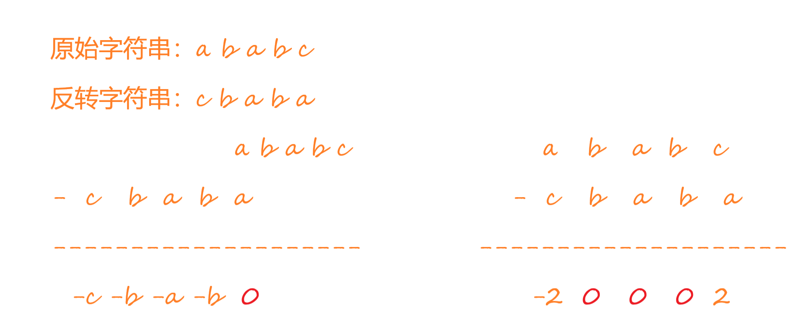
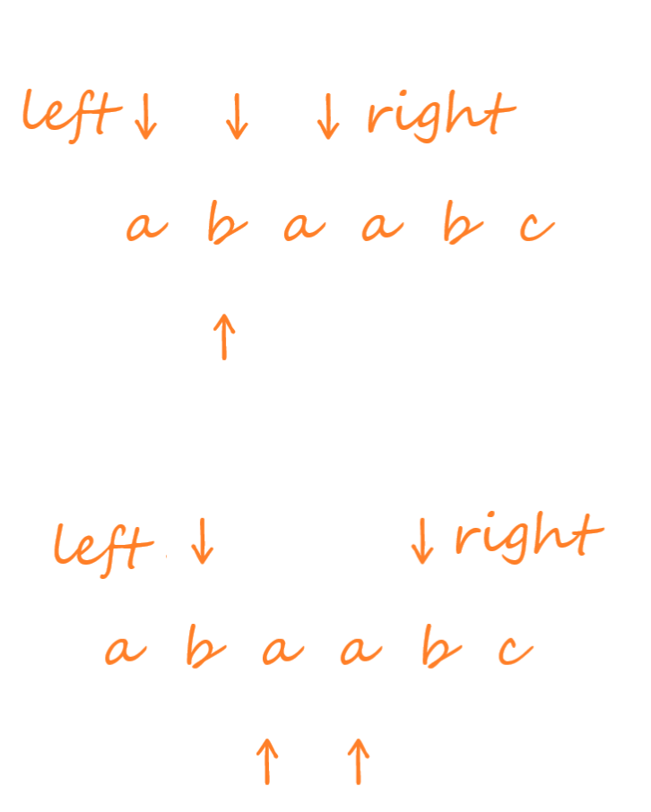

# 菜鸟的算法笔记：最长回文子串


## 问题

给你一个字符串 `s`，找到 `s` 中最长的回文子串。


实际上就是求对称的连续字符串。

停下来思考下，你能想到什么解法？

## 解决方法

第一次看到这题的时候，第一个想法是字符串倒转过来，滑动字符串，然后两个字符串相减，再看有几个连续的0即可。



显而易见，这个方法的时间复杂度是$O(n^2)$，空间复杂度是$O(n)$。借助两个指针，可以让空间复杂度降为$O(1)$。

### 中心扩展法

中心扩展法就是找到对称轴，然后用两个指针分别向左右滑动。



需要注意的是，中心轴可能是一个字母，如上图中的 $b$，也可能是两个字符，如上图中的 $aa$。

代码实现如下：

```python
class Solution:
    def longestPalindrome(self, s: str) -> str:
        n = len(s)
        self.longest_length = 1
        self.longest_palindrome = s[0]
        def find_longest_palindrome(left, right):
            while left >= 0 and right < n:
                if s[left] == s[right]:
                    left, right = left - 1, right + 1
                else:
                    break
            if right - left - 1 > self.longest_length:
                self.longest_length = right - left - 1
                self.longest_palindrome = s[left+1: right]

        for i in range(1, len(s)):
            # 以i为中间轴
            find_longest_palindrome(i, i)
            if s[i] == s[i-1]:
                find_longest_palindrome(i-1, i)
        return self.longest_palindrome
```

#### 复杂度分析

##### 时间复杂度

以上程序最耗时的是第16行和第7行。

第16行需要对字符串进行一次遍历，第7行每次循环最多只需要遍历一次字符串。所以时间复杂度为$O(n^2)$。

假设回文字符串最大长度为 $k$，则时间复杂度可以更精确的描述为 $O(kn)$。

##### 空间复杂度

本程序没有额外申请大小与 $n$ 有关的空间，所以空间复杂度为 $O(1)$。

#### 算法实测

Accepted

-   176/176 cases passed (808 ms)
-   Your runtime beats 88.78 % of python3 submissions
-   Your memory usage beats 57.45 % of python3 submissions (15.1 MB)

### 动态规划法

动态规划是解决多阶段决策最优解问题的思路。它是回溯法的优化，我这个菜鸟暂时将它看作是回溯法加上备忘录的功能。

接下来结合本题示例分析。

```
比如针对字符串： a b b a
```

| 阶段序号 | 阶段划分依据  | 分析的字符子串 | 是否为回文子串 |
| :------: | :-----------: | :------------: | :------------: |
|    1     | 长度为1的子串 |      $a$       |       是       |
|    2     |               |      $b$       |       是       |
|    3     |               |      $b$       |       是       |
|    4     |               |      $a$       |       是       |
|    5     | 长度为2的子串 |      $ab$      |       否       |
|    6     |               |      $bb$      |       是       |
|    7     |               |      $ba$      |       否       |
|    8     | 长度为3的子串 |     $abb$      |       否       |
|    9     |               |     $bba$      |       否       |
|    10    | 长度为4的子串 |     $abba$     |       是       |

回溯和动态规划都会遍历所有情况。但是回溯不会记录中间状态，比如在阶段10，判断$abba$是否为回文子串，可以根据上述两个方法来判断。

但是，也很容易发现，判断$abba$是否为回文子串的时候，如果事先知道$bb$是否为回文子串，那就只需要判断第一个字符和最后一个是否相等就可以了。如果相等，那$abba$肯定是回文子串。

所以在按阶段依次遍历的时候，弄个备忘录记录下中间结果。

这就是回溯加备忘录的基本思想了。

实现代码如下：

```python
class Solution:
    def longestPalindrome(self, s: str) -> str:   
        n = len(s)
        # 回文子串起始坐标和终点坐标
        low, high = 0, 0
        # 初始化备忘录，dp[i][j]表示从s[i:j+1]是不是为回文子串
        dp = [[False] * n for _ in range(n)]
        dp[0][0] = True
        for i in range(1, n):
            dp[i][i] = True
            if s[i] == s[i-1]:
                dp[i-1][i] = True
                if high - low == 0: low, high = i-1, i
        # 动态规划的过程
        for l in range(3, n + 1):
            for i in range(n - l + 1):
                j = l + i - 1
                if s[i] == s[j] and dp[i+1][j-1]:
                    dp[i][j] = True
                    if high - low < j - i:
                        low, high = i, j
        return s[low: high + 1]
```

#### 复杂度分析

##### 时间复杂度

由程序第15行和第16行可知，程序复杂度为$O(n^2)$

##### 空间复杂度

由程序第7行可知，程序空间复杂度为$O(n^2)$

#### 算法实测

 Accepted

-   176/176 cases passed (6128 ms)
-   Your runtime beats 43.31 % of python3 submissions
-   Your memory usage beats 18.06 % of python3 submissions (22.6 MB)
