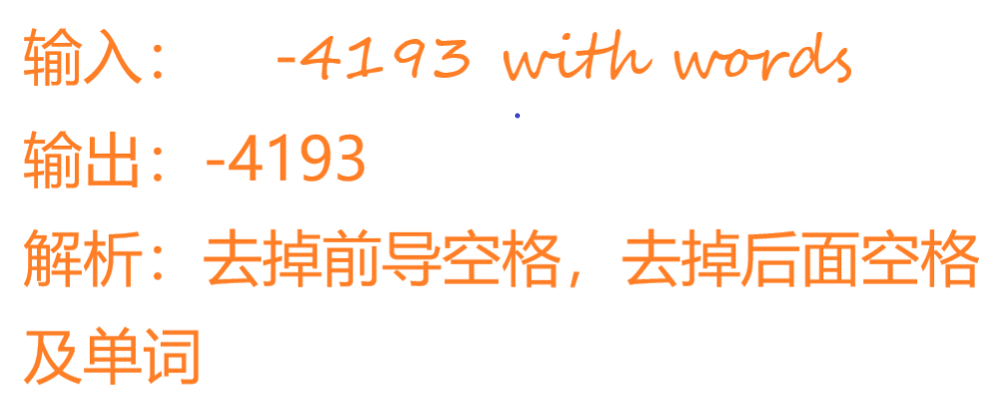

# 菜鸟的算法笔记：字符串转换整数

## 问题

请你来实现一个 `myAtoi(string s)` 函数，使其能将字符串转换成一个 32 位有符号整数（类似 C/C++ 中的 `atoi` 函数）。

函数 `myAtoi(string s)` 的算法如下：

-   读入字符串并丢弃无用的前导空格
-   检查下一个字符（假设还未到字符末尾）为正还是负号，读取该字符（如果有）。 确定最终结果是负数还是正数。 如果两者都不存在，则假定结果为正。
-   读入下一个字符，直到到达下一个非数字字符或到达输入的结尾。字符串的其余部分将被忽略。
-   将前面步骤读入的这些数字转换为整数（即，"123" -> 123， "0032" -> 32）。如果没有读入数字，则整数为 `0` 。必要时更改符号（从步骤 2 开始）。
-   如果整数数超过 32 位有符号整数范围 `[−231, 231 − 1]` ，需要截断这个整数，使其保持在这个范围内。具体来说，小于 `−231` 的整数应该被固定为 `−231` ，大于 `231 − 1` 的整数应该被固定为 `231 − 1` 。
-   返回整数作为最终结果。

停下来思考下，你能想到什么解法？

## 解决方法

### 逻辑暴力枚举法

### 有限状态机法

